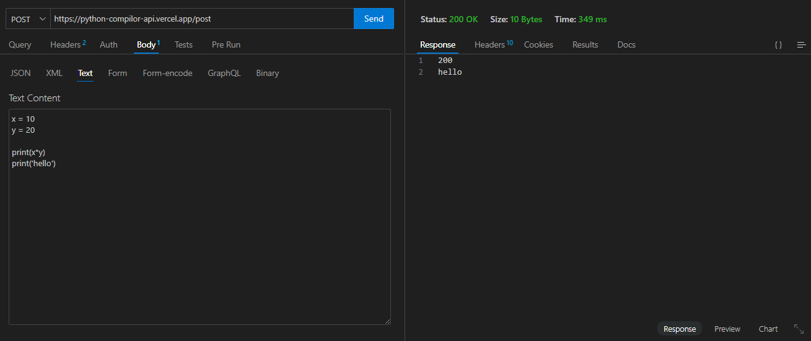

# python_compilor-api

## Deployment
* [VERCEL-DEPLOYMENT](https://python-compilor-api.vercel.app/post)

## Overview
* This Python API enables you to compile and execute Python code remotely.
* It's designed for use in integration scenarios, allowing other applications to submit Python code and receive the execution results.

## Key Features
* **RESTful API:** Accepts HTTP POST requests with Python code in the request body.
* **CORS Support:** Integrates `flask-cors` to enable cross-origin requests from different domains.
* **Vercel Deployment:** Deployed on [VERCEL](https://python-compilor-api.vercel.app/post) for easy access and scalability.

## Endpoint
* ` URL /post`

## API Calling
* Send a POST request to the `/post` endpoint with the Python code you want to execute in the request body (e.g., using tools like Postman, cURL, or code in another language).
* The API accepts request in text or string format and responds in the same.

